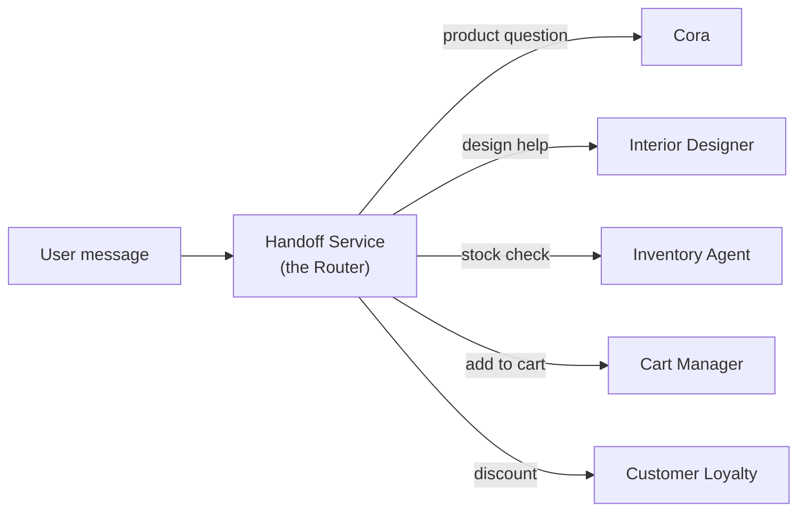

# Exercise 02: Implement a multimodal AI shopping assistant

## Scenario

This training will have you implement a customer proof of concept using Microsoft Foundry. The customer in this scenario is Zava, a retail chain that specializes in "do-it-yourself" solutions for home improvement projects. Zava would like to build a shopping assistant that helps customers choose the correct products for their own home improvement projects. Customers will be able to upload images, ask questions regarding the set of products available from Zava, and make purchases, all from a multimodal chat interface.

In this exercise, we will build a series of agents and test them locally before deploying the application code to Azure.

## Objectives

After you complete this exercise, you will be able to:

* Build a chat application that allows customers to research products, add products to a cart, and receive loyalty discounts
* Incorporate multiple AI agents to satisfy specific customer needs
* Deploy applications to Azure from Visual Studio Code

## Duration

* **Estimated Time:** 60 minutes

## How agents work together in this exercise

This exercise uses the **Router pattern** (also called *handoff routing*). It's important to understand this up front because Exercise 03 will use a **different** pattern (the *Manager pattern* with the A2A Protocol) — and beginners often confuse the two.

**Key idea:** the Router (`HandoffService`) looks at the user's message, decides which **single** specialist agent should handle it, and sends the message there. Only **one** agent answers each message.

> 💡 **Heads-up for Exercise 03**
> In the next exercise you'll meet a *Manager* (`ProductManagerAgent`) instead of a *Router*. The Manager can call **several** sub-agents per message and combines their answers — a very different style of coordination. A full side-by-side comparison is included on the [Exercise 03 landing page](../03_extend_shopping_assistant_with_a2a/03_extend_shopping_assistant_with_a2a.html#background-multi-agent-router-vs-a2a-manager--whats-the-difference).
