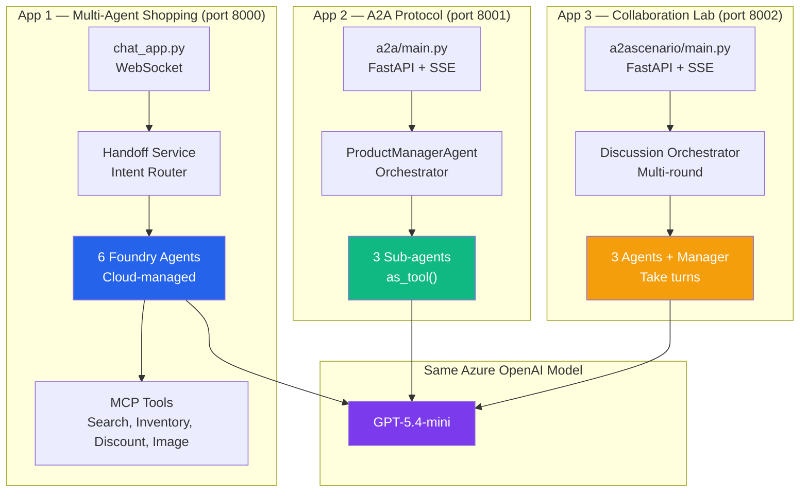

# Solution Overview

## What is Zava?

Zava is a fictional home-improvement retail chain. This workshop builds an **AI-powered shopping assistant** for Zava using Microsoft's AI agent technologies. Customers can:

- Search for paint colors, brushes, rollers, and accessories
- Upload photos of rooms for interior design suggestions
- Get AI-generated product images
- Manage a shopping cart through conversation
- Receive personalized loyalty discounts

The solution demonstrates **three different approaches** to building AI agents, running as three separate apps side by side.

---

## The Three Apps

| App | Port | Framework | What it demonstrates |
|-----|------|-----------|---------------------|
| **Multi-Agent Shopping Assistant** | 8000 | Azure AI Foundry Agents | Production-grade multi-agent routing with managed cloud agents, MCP tools, and full observability |
| **A2A Protocol Demo** | 8001 | Microsoft Agent Framework + A2A | Agent-to-agent communication via the A2A protocol with real-time visualization |
| **Agent Collaboration Lab** | 8002 | Microsoft Agent Framework | Multi-round agent-to-agent discussions where agents debate and reach consensus |

---

## Technology Stack

| Layer | Technologies |
|-------|-------------|
| **AI Models** | Azure OpenAI (GPT-5.4-mini, text-embedding-3-large, Phi-4, gpt-image-1) |
| **Agent Frameworks** | Azure AI Foundry Agents SDK, Microsoft Agent Framework (`agent_framework`) |
| **Protocols** | A2A (Agent-to-Agent), MCP (Model Context Protocol) |
| **Backend** | Python 3.12, FastAPI, uvicorn |
| **Data** | Azure Cosmos DB (NoSQL + vector search), Azure AI Search |
| **Storage** | Azure Blob Storage (product images) |
| **Observability** | OpenTelemetry, Azure Monitor, Application Insights, Foundry Tracing |
| **Infrastructure** | Azure Bicep, Azure Container Apps, Azure Container Registry |
| **CI/CD** | GitHub Actions |
| **Security** | Managed Identity (DefaultAzureCredential), Azure Content Safety |

---

## Quick Start

### Prerequisites

- Azure subscription with Contributor access
- Python 3.12+
- VS Code with Python extension
- Azure CLI (`az`) logged in
- Git

### Run All Three Apps

After deploying Azure resources (see [Exercise 01](../01_deploy_configure_resources/01_deploy_configure_resources.md)) and configuring `.env`:

```powershell
cd src

# Terminal 1: Multi-Agent Shopping Assistant (port 8000)
python -m uvicorn chat_app:app --port 8000

# Terminal 2: A2A Protocol Demo (port 8001)
cd a2a
python main.py

# Terminal 3: Agent Collaboration Lab (port 8002)
cd a2ascenario
python main.py
```

Then open:
- http://127.0.0.1:8000 — Shopping Assistant
- http://127.0.0.1:8001 — A2A Protocol Demo
- http://127.0.0.1:8002 — Agent Collaboration Lab

---

## How the Apps Relate



All three apps call the **same Azure OpenAI model** — they differ in how agents are defined, orchestrated, and managed.

---

## Workshop Exercises Flow

| Exercise | Duration | What you build |
|----------|----------|---------------|
| 01 — Deploy Resources | 60 min | Azure infra (Bicep), Cosmos DB, AI Search, Foundry project |
| 02 — Shopping Assistant | 60 min | Multi-agent chat with handoff routing, MCP tools, image understanding |
| 03 — A2A Protocol | 40 min | Agent-to-Agent communication demo |
| 04 — Observability | 60 min | Foundry tracing, App Insights, agent quality evaluation |
| 05 — Agentic DevOps | 60 min | GitHub Actions for CI/CD + Foundry agent deployment |
| 06 — Red Teaming | 40 min | Automated AI red teaming scans |
| 07 — Cleanup | 5 min | Delete Azure resources |

---

## Next Steps

- [Architecture Deep Dive](02-architecture-deep-dive.md) — detailed diagrams and code flows
- [Agent Patterns Comparison](03-agent-patterns-comparison.md) — when to use which approach
- [Implementation Guide](04-implementation-guide.md) — build it yourself step by step
