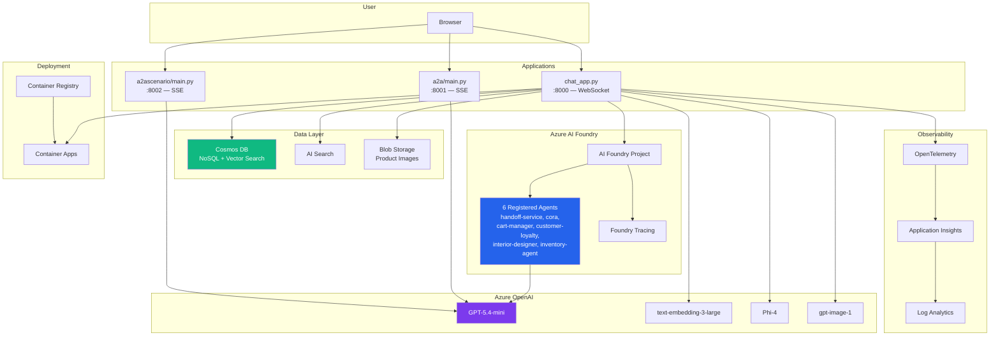
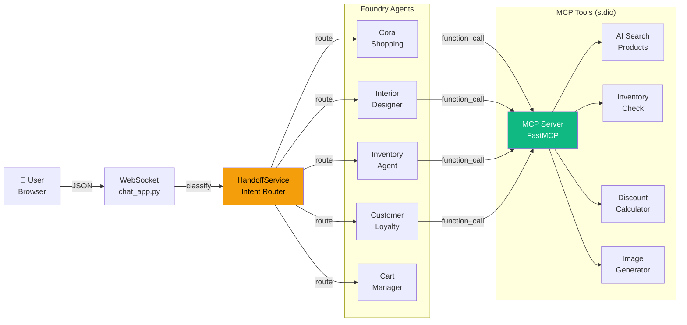
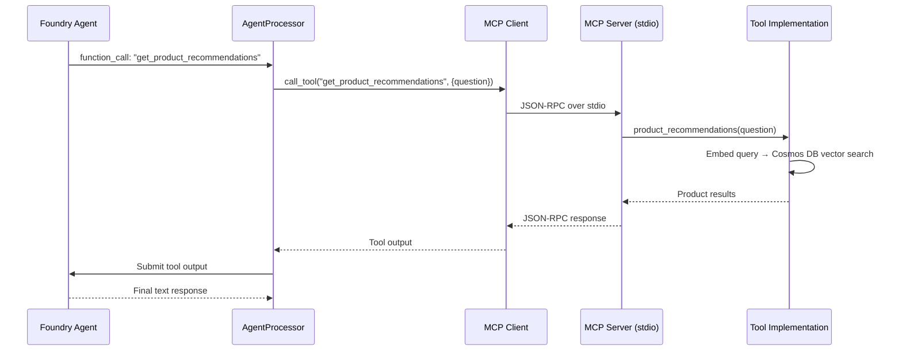
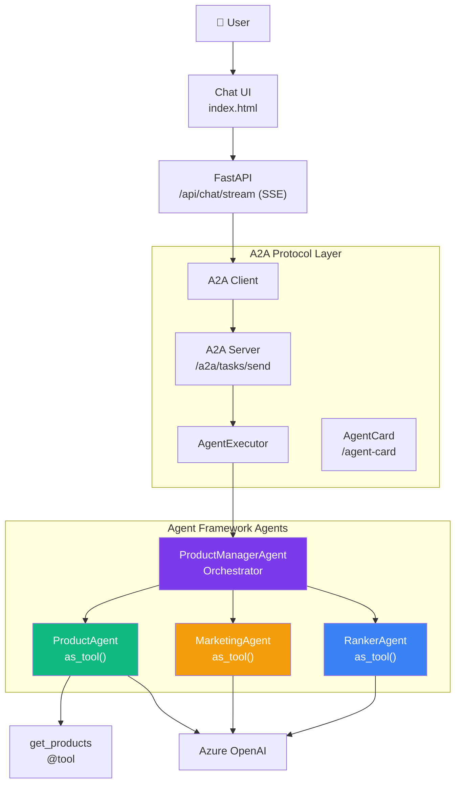
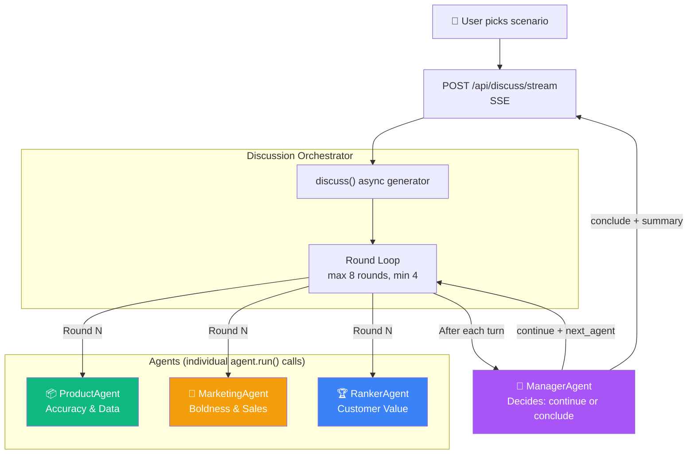
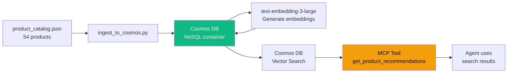

# Architecture Deep Dive

This document covers the architecture of all three apps with diagrams and code-level flow walkthroughs.

---

## System Architecture



---

## App 1: Multi-Agent Shopping Assistant

### Architecture



### Code Flow: User Message → Response

```
1. User sends WebSocket message
   └─ chat_app.py: websocket_endpoint()

2. Parse JSON: {message, image_url, conversation_history, cart}
   └─ orjson.loads(data)

3. Background: Customer loyalty (once per session)
   └─ asyncio.create_task(run_customer_loyalty_task())
   └─ Calls customer-loyalty Foundry agent
   └─ Stores discount % for later

4. Classify intent → select agent
   └─ handlers/multi_agent_handler.py: classify_intent()
   └─ services/handoff_service.py: HandoffService.classify()
   └─ LLM call to handoff-service agent
   └─ Returns: {domain: "cora", confidence: 0.95}
   └─ Maps domain → Foundry agent ID from env vars

5. Enrich context
   └─ handlers/multi_agent_handler.py: enrich_context()
   └─ If image_url → get cached image description (Phi-4)
   └─ If cora/interior_designer → vector search for products
   └─ Build enriched message string

6. Execute agent
   └─ handlers/multi_agent_handler.py: execute_agent()
   └─ services/agent_service.py: get_or_create_agent_processor()
   └─ app/agents/agent_processor.py: AgentProcessor.run_conversation_with_text_stream()
   └─ OpenAI Responses API with agent_reference
   └─ If agent requests function_call:
       └─ app/agents/mcp_tools.py: MCP_FUNCTIONS[tool_name]()
       └─ app/servers/mcp_inventory_client.py → stdio → mcp_inventory_server.py
       └─ Feed tool result back → get final response

7. Process response
   └─ handlers/multi_agent_handler.py: process_response()
   └─ Parse JSON, update cart, persist discount %
   └─ Send response over WebSocket
```

### Agent Inventory

| Agent | Foundry Name | Prompt File | MCP Tools | Role |
|-------|-------------|-------------|-----------|------|
| **Handoff Service** | `handoff-service` | `HandoffAgentPrompt.txt` | — | Intent classification → routes to correct agent |
| **Cora** | `cora` | `ShopperAgentPrompt.txt` | `get_product_recommendations` | General shopping assistant, product browsing |
| **Interior Designer** | `interior-designer` | `InteriorDesignAgentPrompt.txt` | `get_product_recommendations` | Room design, color schemes, image creation |
| **Inventory Agent** | `inventory-agent` | `InventoryAgentPrompt.txt` | `check_product_inventory` | Stock levels and availability |
| **Customer Loyalty** | `customer-loyalty` | `CustomerLoyaltyAgentPrompt.txt` | `get_customer_discount` | Personalized discount calculation |
| **Cart Manager** | `cart-manager` | `CartManagerPrompt.txt` | — | Add/remove items, checkout |

### MCP Tool Flow



---

## App 2: A2A Protocol Demo

### Architecture



### Code Flow

```
1. User sends message via chat UI
   └─ POST /api/chat/stream

2. SSE stream starts
   └─ a2a/api/chat.py: stream_message()
   └─ Emit trace events: user → client → server → manager

3. Agent execution
   └─ a2a/agent/product_management_agent.py: invoke()
   └─ ProductManagerAgent.run(message, session)
   └─ LLM decides which sub-agents to call via as_tool()

4. Sub-agent delegation (automatic via agent_framework)
   └─ ProductAgent.run() → calls get_products @tool
   └─ MarketingAgent.run() → returns marketing advice
   └─ RankerAgent.run() → returns ranking

5. Real-time log capture
   └─ LiveLogHandler captures agent_framework logs
   └─ Detects "Function name:" → emits trace SSE events
   └─ UI diagram lights up per agent

6. Final response
   └─ Structured ResponseFormat {status, message}
   └─ Emitted as SSE response event
```

### Key Concept: `as_tool()`

Sub-agents are exposed as **tools** on the orchestrator agent:

```python
# Each sub-agent becomes a callable tool
self.agent = Agent(
    name="ProductManagerAgent",
    tools=[
        product_agent.as_tool(),    # LLM can call ProductAgent
        marketing_agent.as_tool(),  # LLM can call MarketingAgent
        ranker_agent.as_tool(),     # LLM can call RankerAgent
    ],
)
```

The LLM decides **at runtime** which sub-agents to invoke — it can call one, multiple, or none.

---

## App 3: Agent Collaboration Lab

### Architecture



### Discussion Flow

```mermaid
sequenceDiagram
    participant U as User
    participant O as Orchestrator
    participant P as ProductAgent
    participant Mk as MarketingAgent
    participant R as RankerAgent
    participant M as Manager

    U->>O: Select scenario (e.g., "Price Hike Debate")

    rect rgb(20, 40, 60)
        Note over O: Round 1 (always ProductAgent first)
        O->>P: Scenario + empty transcript
        P-->>O: "Standard Roller is $8.49, specs don't justify $14.99"
    end

    O->>M: Transcript (1 turn) — who's next?
    M-->>O: continue → MarketingAgent

    rect rgb(40, 30, 10)
        Note over O: Round 2
        O->>Mk: Scenario + transcript
        Mk-->>O: "I disagree — perception matters more than specs"
    end

    O->>M: Transcript (2 turns) — who's next?
    M-->>O: continue → RankerAgent

    rect rgb(10, 30, 50)
        Note over O: Round 3
        O->>R: Scenario + transcript
        R-->>O: "At $14.99 it undercuts our own Eco-Friendly roller"
    end

    O->>M: Transcript (3 turns) — who's next?
    M-->>O: continue → MarketingAgent (challenged)

    rect rgb(40, 30, 10)
        Note over O: Round 4
        O->>Mk: Scenario + transcript
        Mk-->>O: "Fair point. Counter-proposal: $11.99 as Best Value tier"
    end

    O->>M: Transcript (4 turns) — who's next?
    M-->>O: conclude ✅
    O-->>U: Summary: "Compromise at $11.99 with Best Value positioning"
```



### Key Concept: Full Transcript Sharing

Unlike `as_tool()` (App 2), each agent in the Collaboration Lab sees the **entire conversation history**:

```python
user_message = f"""
=== SCENARIO ===
{scenario_prompt}

=== DISCUSSION SO FAR ===
Turn 1 [ProductAgent]: Standard Roller is $8.49...
Turn 2 [MarketingAgent]: I disagree — perception matters...

=== YOUR TURN ===
You are RankerAgent. Reply in 1-2 SHORT sentences.
"""
response = await agent.run(messages=user_message, session=session)
```

This enables agents to **reference each other by name**, **agree or disagree**, and **build on prior turns**.

---

## Data Flow



1. `product_catalog.json` (54 products: paints, rollers, brushes, trays) is ingested into Cosmos DB
2. Each product gets a vector embedding via `text-embedding-3-large`
3. When an agent calls `get_product_recommendations`, the MCP tool runs a **vector search** on Cosmos DB
4. Results are returned to the agent as context for generating responses

---

## Infrastructure (Azure Resources from Bicep)

| Resource | Type | Purpose |
|----------|------|---------|
| **Cosmos DB** | NoSQL | Product catalog with vector search |
| **Storage Account** | Blob | Product images, AI-generated images |
| **AI Foundry** (AIServices) | Cognitive Services | Hosts AI models + Foundry project |
| **AI Project** | Foundry Project | Agent management, tracing, evaluations |
| **Log Analytics** | Workspace | Log aggregation (90-day retention) |
| **Application Insights** | Monitoring | Traces, metrics, logs from apps |
| **Container Registry** | ACR | Docker image storage |
| **Container Apps Environment** | ACA | Serverless container hosting |
| **Container App** | ACA | Runs the chat_app (1 CPU, 2GB RAM) |

All resources share a single resource group and use **Managed Identity** for authentication (no API keys).

---

## Next Steps

- [Agent Patterns Comparison](03-agent-patterns-comparison.md) — when to use which approach
- [Implementation Guide](04-implementation-guide.md) — build it step by step
