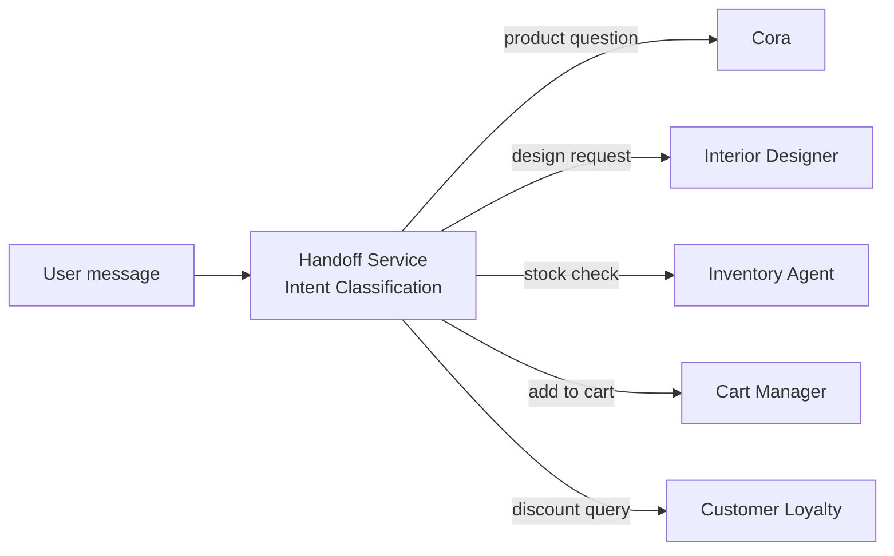
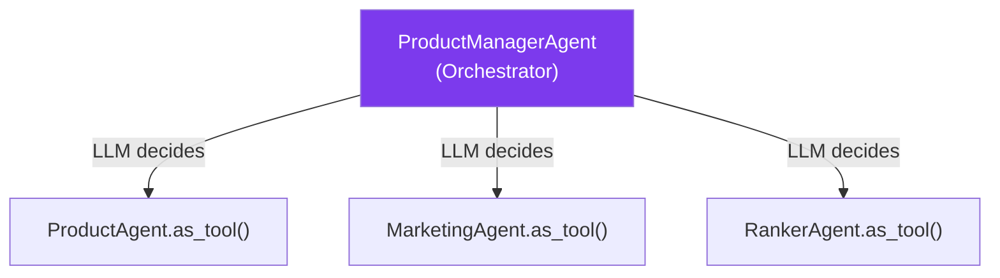
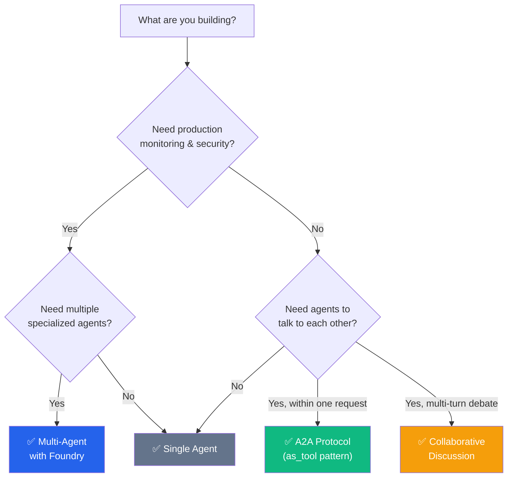

# Agent Patterns Comparison

This document compares the four agent patterns used in the workshop and helps you decide which one to use.

---

## Side-by-Side Comparison

| | **Single Agent** | **Multi-Agent (Foundry)** | **A2A Protocol** | **Collaborative Discussion** |
|---|---|---|---|---|
| **App** | chat_app.py (commented out) | chat_app.py (active) | a2a/ | a2ascenario/ |
| **Framework** | Raw Azure OpenAI SDK | Azure AI Foundry Agents | Microsoft Agent Framework | Microsoft Agent Framework |
| **Agents defined in** | Python code | Azure Foundry (cloud) | Python code (local) | Python code (local) |
| **Number of agents** | 1 | 6 | 4 (1 orchestrator + 3 sub) | 4 (3 speakers + 1 manager) |
| **Routing** | None | LLM-based intent classification | LLM decides via `as_tool()` | Fixed first turn + Manager decides |
| **Tools** | None | MCP (AI Search, Inventory, Discount, Image) | `get_products` @tool | `get_products` @tool |
| **Inter-agent comms** | None | None (single agent per request) | via `as_tool()` (within one turn) | Full transcript sharing (multi-turn) |
| **Streaming** | No | WebSocket | SSE | SSE |
| **Observability** | None | Full (OpenTelemetry + Foundry Tracing) | None (can be added) | None (can be added) |
| **Complexity** | Very Low | High | Medium | Medium |
| **Production-ready** | No | Yes | Prototype | Prototype |

---

## Pattern 1: Single Agent

**What it is**: One LLM call with a system prompt. No routing, no tools, no agent management.

```python
# The simplest possible agent — just a chat completion call
response = client.chat.completions.create(
    model=deployment_name,
    messages=[
        {"role": "system", "content": "You are a helpful assistant for Zava..."},
        {"role": "user", "content": user_message}
    ]
)
```

**When to use**:
- Learning / prototyping
- Simple Q&A bots with no tool needs
- When you want to understand the baseline before adding complexity

**Pros**: Dead simple, fast, no infrastructure needed  
**Cons**: No tools, no routing, no memory, no specialization

**Code**: [src/app/tools/singleAgentExample.py](../../src/app/tools/singleAgentExample.py)

---

## Pattern 2: Multi-Agent with Foundry

**What it is**: Multiple specialized agents deployed as managed services in Azure AI Foundry. A handoff router classifies user intent and sends each message to the right agent. Agents use MCP tools.



**When to use**:
- Production applications
- When you need versioning, tracing, evaluations, red teaming (Foundry features)
- Complex workflows with distinct domains (shopping, design, inventory, etc.)
- When agents need specialized tools (search, APIs, databases)

**Pros**:
- Full Foundry feature set (tracing, monitoring, versioning, evals, red teaming)
- Managed Identity — no API keys in code
- Agent definitions stored in cloud — can update without redeploying code
- MCP tools are discoverable and testable independently

**Cons**:
- More infrastructure (Foundry project, agent registration, MCP server)
- Higher latency (cloud round-trips for each agent call)
- More complex to debug (multiple moving parts)

**Key files**:
- [src/handlers/multi_agent_handler.py](../../src/handlers/multi_agent_handler.py) — 5-step pipeline
- [src/services/handoff_service.py](../../src/services/handoff_service.py) — intent router
- [src/app/agents/agent_processor.py](../../src/app/agents/agent_processor.py) — Foundry agent caller
- [src/app/servers/mcp_inventory_server.py](../../src/app/servers/mcp_inventory_server.py) — MCP tools

---

## Pattern 3: Agent Framework + A2A Protocol

**What it is**: Agents defined in Python code using `agent_framework.Agent`. Sub-agents are composed as tools via `as_tool()`. The A2A protocol layer adds HTTP-based agent discovery and task management.



**When to use**:
- Rapid prototyping — define agents in code, no cloud setup
- A2A protocol demos — show inter-agent communication over HTTP
- When you don't need Foundry's managed features
- Multi-agent orchestration within a single request

**Pros**:
- Fast to set up (just Python code + Azure OpenAI)
- A2A protocol adds agent discovery (AgentCard) and task management
- `as_tool()` composition is elegant — LLM decides which agents to call
- No Foundry project needed

**Cons**:
- No Foundry tracing, evaluations, red teaming, or versioning
- No managed agent lifecycle (agents are just Python objects)
- Observability must be added manually (OpenTelemetry)
- `as_tool()` doesn't let agents see each other's responses (no true conversation)

**Key files**:
- [src/a2a/agent/product_management_agent.py](../../src/a2a/agent/product_management_agent.py) — agents + orchestrator
- [src/a2a/agent/a2a_server.py](../../src/a2a/agent/a2a_server.py) — A2A protocol layer
- [src/a2a/api/chat.py](../../src/a2a/api/chat.py) — SSE streaming with trace events

---

## Pattern 4: Collaborative Discussion

**What it is**: Multiple agents take turns in a multi-round conversation. Each agent sees the full transcript. A Manager agent decides when to continue (and who speaks next) or conclude (with a consensus summary).

```mermaid
graph LR
    S["Scenario"] --> R1["Round 1<br/>ProductAgent"]
    R1 --> M1["Manager: continue → Marketing"]
    M1 --> R2["Round 2<br/>MarketingAgent"]
    R2 --> M2["Manager: continue → Ranker"]
    M2 --> R3["Round 3<br/>RankerAgent"]
    R3 --> M3["Manager: continue → Marketing"]
    M3 --> R4["Round 4<br/>MarketingAgent"]
    R4 --> M4["Manager: conclude ✅"]
    M4 --> C["Consensus Summary"]
```



**When to use**:
- Demonstrating agent-to-agent debate and collaboration
- Scenarios where multiple perspectives need to be explored
- When you want agents to challenge, agree, or build on each other
- Educational / demo purposes — shows how agents can have true conversations

**Pros**:
- True multi-turn agent conversation (not just tool calls)
- Full transcript sharing — agents reference each other by name
- Manager-driven termination — natural conclusion
- Great for demos — visually shows the discussion unfolding

**Cons**:
- Higher latency (sequential LLM calls per turn)
- Higher token usage (transcript grows each round)
- Not a standard production pattern
- Manager decision quality depends on prompt engineering

**Key files**:
- [src/a2ascenario/discussion_agent.py](../../src/a2ascenario/discussion_agent.py) — orchestrator + agents
- [src/a2ascenario/main.py](../../src/a2ascenario/main.py) — SSE endpoint + scenarios

---

## Foundry vs No Foundry

| Feature | **With Foundry** (chat_app) | **Without Foundry** (a2a, a2ascenario) |
|---------|---------------------------|--------------------------------------|
| Agent definition | Cloud-managed, versioned | Python code, git-versioned |
| Tracing | ✅ Foundry Tracing portal (prompts, tokens, latency) | ❌ Must add OpenTelemetry manually |
| Red Teaming | ✅ Built-in red teaming scans | ❌ Custom scripts only |
| Evaluations | ✅ Foundry evaluation datasets | ❌ Custom evaluation code |
| Content Safety | ✅ Foundry-level + model-level | ⚠️ Model-level only (basic filters) |
| Agent versioning | ✅ v1, v2, v3… in Foundry | ❌ Git commits only |
| Managed Identity | ✅ Automatic via Foundry | ✅ Works via DefaultAzureCredential |
| Setup effort | Higher (Foundry project + agent registration) | Lower (just Python + Azure OpenAI) |

---

## Decision Flowchart



**Quick decision rules**:
- Building for **production** → Multi-Agent with Foundry
- Building a **prototype or demo** → A2A Protocol
- Want to show **agents debating** → Collaborative Discussion
- Just **learning** → Single Agent first

---

## Next Steps

- [Implementation Guide](04-implementation-guide.md) — build each pattern yourself
- [Demo Script](05-demo-script.md) — how to present these patterns to an audience
