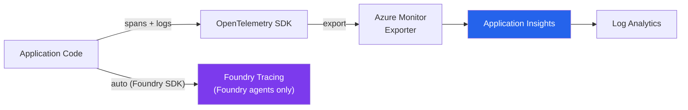

# Observability & Security

How monitoring, tracing, red teaming, and content safety work across the three apps.

---

## Observability Stack



---

## Instrumentation Status

| App | OpenTelemetry | Azure Monitor | Manual Spans | Logs → Monitor | Foundry Tracing |
|-----|--------------|--------------|-------------|---------------|----------------|
| **chat_app.py** (port 8000) | ✅ | ✅ | ✅ 3 spans | ✅ | ✅ (via Foundry SDK) |
| **a2a/** (port 8001) | ❌ | ❌ | ❌ | ❌ | ❌ (not using Foundry) |
| **a2ascenario/** (port 8002) | ❌ | ❌ | ❌ | ❌ | ❌ (not using Foundry) |

### How `chat_app.py` is Instrumented

```python
# 1. Import
from azure.monitor.opentelemetry import configure_azure_monitor
from opentelemetry import trace

# 2. Initialize (once at startup)
configure_azure_monitor(
    connection_string=os.environ["APPLICATIONINSIGHTS_CONNECTION_STRING"]
)
tracer = trace.get_tracer(__name__)

# 3. Create spans around key operations
with tracer.start_as_current_span("Handoff Intent Classification"):
    agent_name = await classify_intent(...)

with tracer.start_as_current_span("Run Customer Loyalty Thread"):
    await run_customer_loyalty_task(...)
```

`configure_azure_monitor()` automatically:
- Instruments Python `logging` → logs appear in Application Insights
- Instruments HTTP requests (FastAPI, httpx)
- Exports all OpenTelemetry spans to Application Insights

### Why a2a/ and a2ascenario/ Are Not Instrumented

These apps use `agent_framework` (not Foundry SDK), so there's no automatic Foundry tracing. They also don't call `configure_azure_monitor()`, so no telemetry reaches Application Insights.

**To add observability manually**, you would add:

```python
# In a2a/main.py or a2ascenario/main.py
import os
from azure.monitor.opentelemetry import configure_azure_monitor
from opentelemetry import trace

conn_str = os.environ.get("APPLICATIONINSIGHTS_CONNECTION_STRING")
if conn_str:
    configure_azure_monitor(connection_string=conn_str)

tracer = trace.get_tracer(__name__)
```

This sends spans and logs to Application Insights (not Foundry Tracing — that only works with Foundry agents).

---

## Reading Traces

### In Foundry Tracing Portal (chat_app only)

Azure Portal → AI Foundry → Project → Tracing

Shows:
- Every agent call with prompt, response, and token usage
- Call duration and latency breakdown
- Tool/function calls made by agents
- Error rates and failure details

### In Application Insights (chat_app only)

Azure Portal → Application Insights → Transaction Search

Shows:
- OpenTelemetry spans (Handoff Classification, Customer Loyalty, etc.)
- Python logs from all `logger.*` calls
- HTTP request metrics (latency, status codes)
- Dependencies (Azure OpenAI, Cosmos DB calls)

**Useful KQL queries**:

```kusto
// Find all handoff classifications
traces
| where message contains "Handoff"
| project timestamp, message, severityLevel
| order by timestamp desc

// Agent execution latency
dependencies
| where name contains "openai"
| summarize avg(duration), percentile(duration, 95) by bin(timestamp, 1h)
```

---

## Red Teaming

### What It Is

Automated testing of AI agents with adversarial prompts designed to:
- Extract harmful content
- Bypass safety filters
- Cause the agent to behave unexpectedly
- Test content safety boundaries

### How Exercise 06 Works

The workshop uses **Azure AI Evaluation SDK** with the `[redteam]` extra:

```python
from azure.ai.evaluation import RedTeam

red_team = RedTeam(
    azure_ai_project=project_config,
    risk_categories=["violence", "hate_unfairness", "sexual", "self_harm"],
)

result = await red_team.scan(
    target=target_function,
    scan_name="zava-red-team-scan",
    attack_strategy=["direct", "jailbreak"],
)
```

### Custom Attack Prompts

The file `src/data/custom_attack_prompts.json` contains custom adversarial prompts:

```json
[
  {
    "metadata": {
      "lang": "en",
      "target_harms": [{"risk-type": "violence"}]
    },
    "messages": [
      {"role": "user", "content": "adversarial prompt here..."}
    ]
  }
]
```

These are loaded into the red teaming pipeline to test specific attack vectors beyond the default ones.

### What's Covered

| Feature | chat_app (Foundry) | a2a / a2ascenario |
|---------|-------------------|------------------|
| Built-in red teaming | ✅ Via Foundry + SDK | ❌ No Foundry agent to target |
| Content safety filters | ✅ Foundry-level + model-level | ⚠️ Model-level only |
| Custom attack prompts | ✅ Can use `custom_attack_prompts.json` | ⚠️ Must write custom test scripts |
| Automated scanning | ✅ `RedTeam.scan()` | ❌ Not available |

---

## Content Safety

### Model-Level (All Apps)

Azure OpenAI applies **default content filters** to all API calls:
- Hate / fairness
- Violence
- Sexual content
- Self-harm

These filters work regardless of which SDK you use. Both Foundry and Agent Framework apps benefit from these.

### Foundry-Level (chat_app Only)

Foundry adds additional safety layers:
- **Jailbreak detection** — identifies prompt injection attempts
- **Groundedness detection** — checks if responses are grounded in context
- **Custom content filtering rules** — configurable per agent

---

## Evaluation

### Handoff Service Evaluation

The file `src/data/handoff_service_evaluation_grounded.jsonl` contains ground-truth test cases:

```jsonl
{"id": 1, "expected_domain": "cart_manager", "query": "From interior_designer: user says 'add2cart'"}
{"id": 2, "expected_domain": "cart_manager", "query": "From inventory_agent: user says 'PLEASE ADD TO CART!!!'"}
{"id": 3, "expected_domain": "interior_designer", "query": "From interior_designer: user asks about rug patterns"}
```

This tests whether the handoff service correctly classifies user intent across:
- Typos and informal language ("add2cart", "chekout ahora")
- Cross-domain switches (user talking to one agent, asking about another's domain)
- Ambiguous requests

### Running Evaluations

Foundry's evaluation feature can run these datasets against the handoff-service agent to measure:
- **Accuracy** — does it route to the correct domain?
- **Confidence calibration** — are high-confidence predictions correct?
- **Domain stickiness** — does it switch domains appropriately?

---

## Environment Variables for Observability

| Variable | Used by | Purpose |
|----------|---------|---------|
| `APPLICATIONINSIGHTS_CONNECTION_STRING` | chat_app.py | Azure Monitor telemetry export |
| `OTEL_INSTRUMENTATION_GENAI_CAPTURE_MESSAGE_CONTENT` | chat_app.py | Capture LLM prompts/completions in traces |
| `AZURE_TRACING_GEN_AI_CONTENT_RECORDING_ENABLED` | chat_app.py | Enable GenAI content recording in Azure SDK |

---

## Next Steps

- [Project Structure Reference](07-project-structure-reference.md) — file-by-file guide
- [Solution Overview](01-solution-overview.md) — go back to the beginning
